<a href="https://www.linkedin.com/in/gurubakshyadav/">LinkedIn</a>
&nbsp;&nbsp;/&nbsp;&nbsp;
<a href="https://leetcode.com/u/gurubakshyadav/">LeetCode</a>
&nbsp;&nbsp;/&nbsp;&nbsp;
<a href="mailto:gurubakshyadav71218@gmail.com">Email</a>

 

<h2 align="center"></h2>

I'm a Software Engineering student who likes building scalable web applications, and the data and cloud infrastructure that sit behind them. With a solid grounding in core programming and cloud architecture, I work in the space between software development and data insight: writing efficient backend logic, optimizing data pipelines, and turning raw data into dashboards that people can actually use.

I'm open to internships, software roles, and data / cloud engineering collaborations.

<table align="center">
<tr>
<td align="center" valign="top" width="33%"><b>Software &amp; web</b> Scalable web applications and efficient backend logic.</td>
<td align="center" valign="top" width="33%"><b>Data</b> Data pipelines, analytics, and meaningful dashboards.</td>
<td align="center" valign="top" width="33%"><b>Cloud &amp; DevOps</b> Cloud architecture and infrastructure, with AWS at the centre.</td>
</tr>
</table>

 

<h2 align="center"></h2>

GitPulse analyzes software projects and public GitHub repositories across dependency health, security, maintenance, repository activity, contributor concentration, testing, and documentation. It produces an explainable **Engineering Health Score** with prioritized recommendations.

 

A student-focused web platform that simplifies discovering and preparing for examinations, application forms, counselling processes, scholarships, recruitment opportunities, and the documentation that goes with them.

 

A salary transparency web application for India. It explains the gap between the number on an offer letter and the number that actually lands in a bank account.

 

A data analytics project that analyzes heart-health indicators to predict potential risks and provide actionable health insights.

 

<h2 align="center"></h2>

<b>Languages</b> 
 
Python, C++, C, JavaScript, Java, Dart

<b>Web development</b> 
 
Next.js, Node.js, React, MongoDB, HTML, CSS

<b>Cloud &amp; DevOps</b> 
 
AWS, Git, GitHub

<b>Data &amp; analytics</b> 
&nbsp;&nbsp;

 

<h2 align="center"></h2>

<table align="center">
<tr>
<td><b>AWS Cloud Practitioner</b></td>
</tr>
<tr>
<td><b>AWS Data Engineer – Associate</b></td>
</tr>
<tr>
<td><b>Red Hat Training:</b> Getting Started with Linux Fundamentals (RH104 - RHA) - Ver. 9.1</td>
</tr>
</table>

 

<h2 align="center"></h2>

 

<h2 align="center"></h2>

&nbsp;

&nbsp;

 
gurubakshyadav71218@gmail.com

 

